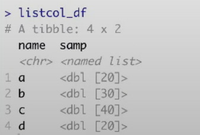

```{r setup, include=FALSE}
knitr::opts_chunk$set(echo = TRUE)
```

## you can put anything in a list

**l_name = list(element1, element2, element3, element4)** #can include data iod difference type/ length.<br>
**l_name$element1** #to access element in the list.<br>
**l_name[[1]]** #to access the first element in the list.<br>
**mean(l[["element1"]])**

## use of loop
**output = vector("list", length = 4)** #create a list with 4 elements, same as 'output = list(element1, element2, element3, element4)'<br>
**for (i in 1:4) {output[[i]] = func(l_name[[i]])}**

## try map
**output = map(l_name, func)** #equivalent to the one above.<br>
**output = map_dbl(l_name, func)** #output as evctor containing dbl, instead of a list.<br>
**output = map_df(l_name, func, .id = "name")** #output as a df containing result from each element, keep track of input id name and put those in "input" col.

## list cols
list can be put in df in col.<br>
**df = tibble(name = c("null", "null", "null", "null"),** <br>
      **samp = l_name)** <br>


## try operations
**map(df$samp, func)** #output list of results after function operation.<br>
**df %>%** <br>
**mutate(summary = map(samp, func))** <br>