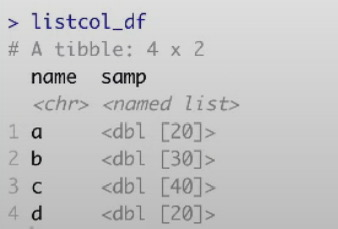

10_28_iter_listcol
================
Yurou Liu
2025-10-30

## you can put anything in a list

**l_name = list(element1, element2, element3, element4)** \#can include
data iod difference type/ length.  **l_name\$element1** \#to access
element in the list.  **l_name\[\[1\]\]** \#to access the first
element in the list.  **mean(l\[\[“element1”\]\])**

## use of loop

**output = vector(“list”, length = 4)** \#create a list with 4 elements,
same as ‘output = list(element1, element2, element3, element4)’ 
**for (i in 1:4) {output\[\[i\]\] = func(l_name\[\[i\]\])}**

## try map

**output = map(l_name, func)** \#equivalent to the one above. 
**output = map_dbl(l_name, func)** \#output as evctor containing dbl,
instead of a list.  **output = map_df(l_name, func, .id = “name”)**
\#output as a df containing result from each element, keep track of
input id name and put those in “input” col.

## list cols

list can be put in df in col.  **df = tibble(name = c(“null”, “null”,
“null”, “null”),**   **samp = l_name)**   

## try operations

**map(df\$samp, func)** \#output list of results after function
operation.  **df %\>%**   **mutate(summary = map(samp, func))**
 
